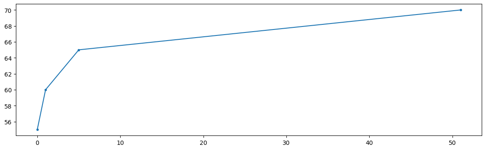

## Algorithm Implementation README

# Lab 2: ES

## Task

Write agents able to play [*Nim*](https://en.wikipedia.org/wiki/Nim), with an arbitrary number of rows and an upper bound $k$ on the number of objects that can be removed in a turn (a.k.a., *subtraction game*).

The goal of the game is to **avoid** taking the last object.

* Task2.1: An agent using fixed rules based on *nim-sum* (i.e., an *expert system*)
* Task2.2: An agent using evolved rules using ES

## Instructions

* Create the directory `lab2` inside your personal course repository for the course 
* Put a `README.md` and your solution (all the files, code and auxiliary data if needed)

## Notes

* Working in group is not only allowed, but recommended (see: [Ubuntu](https://en.wikipedia.org/wiki/Ubuntu_philosophy) and [Cooperative Learning](https://files.eric.ed.gov/fulltext/EJ1096789.pdf)). Collaborations must be explicitly declared in the `README.md`.
* [Yanking](https://www.emacswiki.org/emacs/KillingAndYanking) from the internet is allowed, but sources must be explicitly declared in the `README.md`.

## Overview

This README provides a formal description of the implementation process for an algorithm designed to achieve optimal performance in the nim game. The algorithm involves a training phase using an evolutionary strategy for parameter optimization and a test phase to evaluate the performance of the algorithm.

## Training Phase
The training phase aims to determine optimal parameters for the algorithm. The process involves an evolutionary strategy that uses a population of agents to determine the best parameters.
Before the implementation of the Evolutionary Strategy, that it is used to determine the best parameters, the phenotype of the agent is defined. The phenotype (in this case corresponding to the genotype) is defined as follows:

```
phenotype : (weights, fitness, sigma)
```
where 
* weights is a list of 3 values, which represents the probabilities to choose a rule with respect to another one
* fitness is a value wich represents the percentage of victories using my strategy with respect to the optimal one
* sigma is the standard deviation of the gaussian distribution used to mutate the weights.

### Methods implementation
* The first method implemented is the `fitness` function wich consists in a function that, given the number of rows `(n_rows)` used to build the nim game and the parameters to optimize `(vals)` plays for `(trainings)` times the game using the given optimal strategy (player = 0) and my_strategy (playse = 1) implemented later.
The percentage of victories is returned and it is used to determine the fitness value used in the phenotype of the evolutionary strategy.
* The second method implemented is the `my_strategy()` function
which takes two parameters as input: the `state` (nim table) and the `weights`. The `state` is used to determine all the decisions that the player can take. The choice is given by the `weights` list. Thanks to the `numpy.rand.choice()` function, given that three rules are defined and the `weights` list represents the probabilities to take an action, a rule is chosen. At the beginning, different rules were used in the strategy, but only three of them are significant and used in the code:
  1. take all the items from the row with more items
  2. take one item from the row with less items
  3. take a random choice
* The third method implemented is the `ES()` function. 
The evolutionary strategy (mu + lambda) follows this three steps:
  1. Initialization: the function initializes `mu` individuals in the population, giving the same probability for each rule, so, each element of `weights` is the same. The `fitness` is calculated using this `weights`. Than (`weights`, `fitness`, `sigma`) are put in the population as new individual.
  2. Child generation or mutation: in this second step the population is mutated using the `mutation()` function that takes as input the initial population and generates `lamb` childs. The new individuals are concatenated to the initial population and put in the `offspring` variable (new population composed by `mu + lamb` individuals) and the individual with the best fitness value is selected and compared to the best solution. If the new individual is better than the best one, it is replaced.
  3. New population selection: the best `mu` individuals are selected and put in the new population as survivors.
* The last method implemented is the `mutation()` function. At the beginning empty, it was implemented to generate new individuals starting from the initial population. The function takes as input the initial population and generates `lamb/mu` childs for each parent. Since the starting population is composed of `mu` parents, the new individuals generated will be in total `lamb`. The mutation is done introducing a random noise in the weights, such that,randomly varying the weights, it is possible to find such that combination of weights that maximizes the `fitness` value. The `sigma` variable is used to vary the amount of mutation applied to the weights during the evolution of the population.

The following image shows how the best fitness value changes during the evolution of the population:

The evolutionary strategy generates promising results playing against the optimal strategy. But this results are good againist gabriele, but not so good againist optimal and pure_random in the test phase.

## Test phase: <br> Results
After the Trainig phase is complete, the precomputed optimal weights are used to play the `adaptive` strategy against `optimal`, `pure_random` and `gabriele` strategies.

The results are shown in the following table:

| strategy     | %w |
|--------------|----|
|  optimal     | 34 |
|  pure_random | 61 |
|  gabriele    | 89 |

## Deadline : 23:59, November 17, 2020