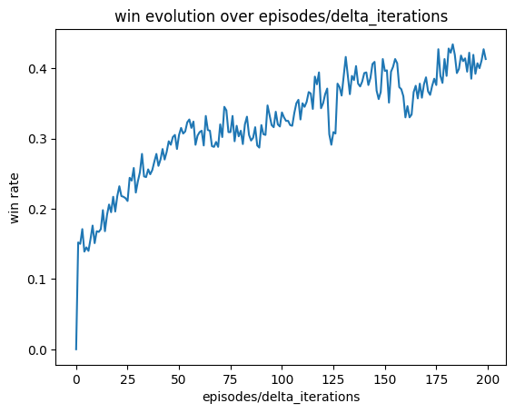

## Algorithm Implementation README

# LAB10

Use reinforcement learning to devise a tic-tac-toe player.

## Overview

In this laboratory there is the implementation of a tic-tac-toe player using reinforcement learning. In particular the player is trained using the Q-Learning algorithm. 

Let's start from the beginning.

## Implementation

### Structure
For the implementation of a reinforcement learning algorithm, it is necessary to define the following elements:
* **Environment**: the environment in this case is the tic-tac-toe game, represented by a board, filled with Xs and Os. The board can be easily printed with the provided method `print_board()`, which takes as input the actual state of the board and prints it putting dots for white spaces.
* **States**: the states are the possible configurations of the environment. In this case the states are the possible configurations of the tic-tac-toe game, represented by the provided code `State = namedtuple('State', ['x', 'o'])` where x and o are lists of the actions chosen by the two players.
* **Actions**: the possible actions that a player can perform on the environment are represented by `MAGIC = [2, 7, 6, 9, 5, 1, 4, 3, 8]`. Each number corresponds to a position on the board. This list is used to evaluate the winner of the game by using the sum method. The player that has a sum of 3 elements equal to 15 wins.
  
  | 2 | 7 | 6 |
  |---|---|---|
  | 9 | 5 | 1 |
  | 4 | 3 | 8 |

* **Reward**: the reward is the value that the agent receives for each action. The reward is implemented in the `get_reward()` method. Different versions of this method have been implemented, in order to evaluate the performances of the agent learning.
  - The first version was the simplest one, (`state_value`), in which the agent receives a reward of 1 if it wins, -1 if it loses and 0 if it draws.
  - The second version is an evolution of the first, and it is implemented in `get_reward_0()`. It assigns +50 if the agent wins, -100 if it loses and 0 if it draws. At the beginning the agent was trained against a random player, and then against itself. Later on it is trained against a player that chooses initially random actions and if it can win it wins (the implementation of this player is contained in `my_player()` method).
  - The third version `get_reward_1()` was adding a penalty of -3 for each action of x on its turn that did not block the opponent from winning, because the opponent will win in the next move. If the action of x is blocking the winning of o, reward += 1. If x sets 3 elements at the corner (config that facilitates the win), reward += 1. If x wins reward += 50.
  - The fourth version `get_reward_2()` is similar to the previous one, but the victory is evaluated at the beginning, if o wins, reward returned is -100, if x wins, reward returned is +50. If during the turn of x, there still remains actions that can make o to win in a single move, reward returned is -100. Other cases are similar to the previous one, but values are multiplied with a coefficient in order to make some particular configurations more desirable.

### Training Phase

The training phase consists in a loop of `episodes` iterations, where the agent constantly updates his table, in order to find the best strategy to get the best reward. The agent starts learning from a random state and than it gradually choses the best action to perform according to the table. In particular, to enhance the tradeoff between exploration and exploitation, the GLIE strategy (Greedy in the Limit with Infinite Exploration) is adopted. In particular it works as follows:
At the beginning the agent doesn't have knowledge about anything, so it chooses random actions for the given states, in order to perform more exploration. Later on it starts to update the table, providing values for each state-action pair, so the agent becomes always more expert in the game and it starts an increasing exploitation phase.
To make it work, at each episode, epsilon is gradually decreased using the formula $$\epsilon_k = \frac{b}{b + k} $$ where k is the episode where that epsilon will be used and b is a constant chosed in order to obtain the value of 0.1 at the end of the training phase.

Different training loops can be visualized plotting the wins over the episodes. In particular, considering an episode interval of `d_iter = 1000`, the percentage of wins in that interval is calculated and plotted. The results obtained are the following:
|     get_reward_0     |     get_reward_1     |     get_reward_2     |
|:--------------------:|:--------------------:|:--------------------:|
| _r0.png) | _r1.png) | _r2.png) |

The training is performed by using:
* GLIE approach
* first turn is random
* `episodes`
* `my_player()`
* `get_reward_0/1/2()`

In particular, performing the same training more times, not always provides the same results. This because the exploration phase is random and it's different at each training. In the same number of episodes, it is possible that the agent learns more or less important things, so it can be more or less expert in the game.

| training         | first training                                           | second training                    | third training                    |
|:------------:|:------------------------------------------------------------:|:-----------------------------------------------------------:|:-----------------------------------------------------------:|
| get_reward_1 |   |  |   |
| get_reward_2 |   |  |   |

### Saving Phase

In order to evaluate the performance of the agent and use the knowledge acquired during the training phase for many tests, the table is saved in a json file using the `save_q_table()` method. The table can be loaded using the `load_q_table()` method and used to test the knowledge learnt.

### Testing Phase

For this phase, the agent plays 1000 games againist a random player and againist the player from which it learns. Two different types of tests have been performed:
* random player test : the agent plays 1000 games against a random player.
* my player test : the agent plays 1000 games against the player from which it learns.
The results obtained are the following:

| test         | random player test                                                           | my player test                                                         |
|:------------:|:----------------------------------------------------------------------------:|:----------------------------------------------------------------------:|
| get_reward_0 |                   |               |
| get_reward_1 |                   |               |
| get_reward_2 |                   |               |

## Results
The agent seems to have learnt how to block the most of the opponent moves, but it still has some problems in winning. Symmetries can be exploited in order to propagate the knowledge acquired to other different but symmetric states.

### Deadlines:

* Submission: [Dies Natalis Solis Invicti](https://en.wikipedia.org/wiki/Sol_Invictus)
* Reviews: [Befana](https://en.wikipedia.org/wiki/Befana)

Notes:

* Reviews will be assigned  on Monday, December 4
* You need to commit in order to be selected as a reviewer (ie. better to commit an empty work than not to commit)